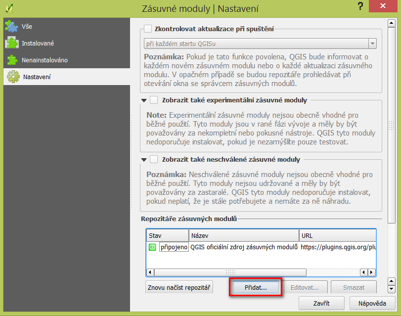
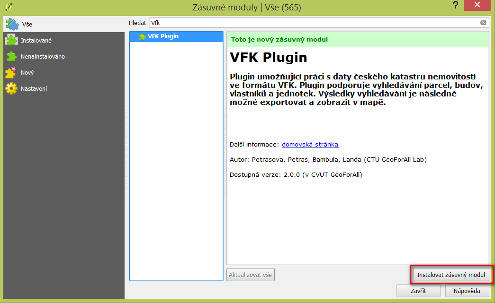

Instalace
---------

Nejprve je nutné v QGISu registrovat repositáø GeoForAll ÈVUT v Praze:
http://geo.fsv.cvut.cz/geoforall/qgis-plugins.xml

.. note:: V souèasné dobì je plugin distribuován jako experimentální. V
          nastavení je tedy nutné aktivovat *Zobrazit také
          experimentální zásuvné moduly*.
          
Poté vybereme *VFK Plugin* a nainstalujeme jej.

           
Po instalaci se v nástrojové lištì objeví nová ikona:

